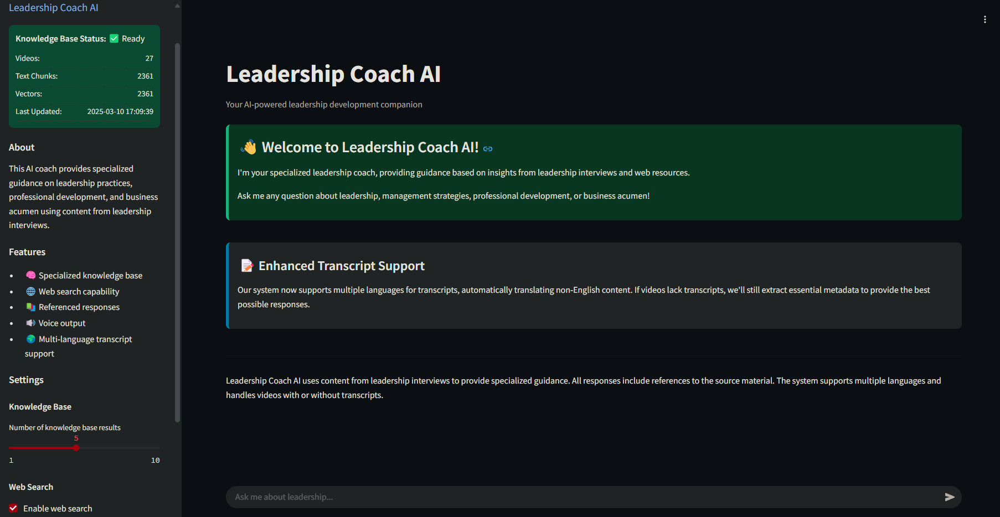

# Leadership Coach AI

<div align="center">
  
  <br>
  <strong>Your AI-powered Leadership Development Companion</strong>
  <br>
  <p>A comprehensive system for creating an intelligent leadership coach powered by YouTube knowledge and web search capabilities</p>
</div>

## 📋 Overview

Leadership Coach AI is a sophisticated AI system that creates a searchable knowledge base from leadership-focused YouTube videos. It uses advanced natural language processing to provide personalized leadership coaching, advice, and training based on curated content.

The system combines audio-based transcription, semantic search capabilities, and intelligent response generation to deliver an interactive coaching experience with referenced answers. All components are optimized for robustness and multilingual support with special focus on Turkish language processing.

<div align="center">
  
</div>

## ✨ Key Features

- **🧠 Specialized Knowledge Base**: Creates an intelligent knowledge base from leadership-focused YouTube videos
- **🔍 Semantic Search**: Uses vector embeddings for accurate semantic retrieval of relevant content
- **🌐 Web Search Integration**: Supplements knowledge base with current web information when needed
- **🗣️ Audio-based Transcription**: Downloads and transcribes any YouTube video using Whisper
- **🔤 Grammar Enhancement**: Improves transcript quality using OpenAI language models
- **🎯 Referenced Responses**: All responses include sources and citations for verification
- **📊 Context-Aware Answers**: Intelligently combines information from multiple sources
- **🔊 Voice Output**: Converts text responses to natural-sounding speech
- **🛡️ Robust Architecture**: Comprehensive error handling and fallback mechanisms
- **📝 Detailed Logging**: Complete logging system for monitoring and debugging
- **⚙️ Customization**: Adjustable parameters for search depth, response generation, and more
- **🌍 Language Optimization**: Special focus on Turkish language with proper character support

## 🛠️ System Architecture

### Knowledge Base Creation Flow

The knowledge base creation process starts with YouTube videos and ends with searchable vector embeddings:

```
┌───────────────────┐     ┌───────────────────┐     ┌───────────────────┐
│                   │     │                   │     │                   │
│  YouTube          │     │  yt-dlp           │     │  Audio Files      │
│  Videos/Playlist  ├────►│  Downloader       ├────►│  (.mp3)           │
│                   │     │                   │     │                   │
└───────────────────┘     └───────────────────┘     └─────────┬─────────┘
                                                              │
                                                              ▼
┌───────────────────┐     ┌───────────────────┐     ┌───────────────────┐
│                   │     │                   │     │                   │
│  Raw JSON         │     │  Whisper Model    │     │  FFmpeg           │
│  Transcripts      │◄────┤  Transcription    │◄────┤  Audio            │
│                   │     │                   │     │  Processing       │
└─────────┬─────────┘     └───────────────────┘     └───────────────────┘
          │
          ▼
┌───────────────────┐     ┌───────────────────┐     ┌───────────────────┐
│                   │     │                   │     │                   │
│  Transcript       │     │  OpenAI LLM       │     │  Text Processing  │
│  Chunks           ├────►│  Grammar          ├────►│  & Cleaning       │
│                   │     │  Improvement      │     │                   │
└─────────┬─────────┘     └───────────────────┘     └───────────────────┘
          │                                                   
          ▼                                                   
┌───────────────────┐     ┌───────────────────┐     ┌───────────────────┐
│                   │     │                   │     │                   │
│  Improved         │     │  OpenAI           │     │  Vector           │
│  Chunks JSON      ├────►│  Embedding        ├────►│  Store            │
│                   │     │  API              │     │  Database         │
└───────────────────┘     └───────────────────┘     └───────────────────┘
```

**Key Components:**

1. **YouTube Extraction**: `YouTubeExtractor` class processes YouTube videos/playlists:
   - Uses `yt-dlp` to download audio and extract metadata
   - Processes videos in batches with parallel processing
   - Saves audio files to `data/audio` directory

2. **Audio Transcription**: Whisper-based transcription:
   - Transcribes audio using OpenAI's Whisper model
   - Creates timestamp-aligned transcript segments
   - Divides content into logical chunks

3. **Text Enhancement**: `ChunkProcessor` improves transcript quality:
   - Corrects grammar and formatting issues using LLMs
   - Optimizes Turkish language content
   - Preserves original source references and timestamps

4. **Vector Embedding**: `VectorStore` creates searchable embeddings:
   - Uses OpenAI's text-embedding-3-small model for embedding
   - Creates efficient vector representations
   - Stores metadata for source attribution

### Application Usage Flow

The application flow shows how user queries are processed and answered:

```
┌───────────────────┐     ┌───────────────────┐     ┌───────────────────┐
│                   │     │                   │     │                   │
│  User Query       ├────►│  Query            │─┬──►│  Vector Store     │
│  (Streamlit UI)   │     │  Processor        │ │   │  Search           │
│                   │     │                   │ │   │                   │
└───────────────────┘     └───────────────────┘ │   └─────────┬─────────┘
                                                │             │
                                                │             ▼
                                                │   ┌───────────────────┐
                                                │   │                   │
                                                │   │  Knowledge Base   │
                                                │   │  Results          │
                                                │   │                   │
                                                │   └─────────┬─────────┘
                                                │             │
                          ┌───────────────────┐ │             │
                          │                   │ │             │
                          │  Result Quality   │ │             │
                          │  Check            │◄──────────────┤            
                          │                   │ │             │
                          └─────────┬─────────┘ │             │
                                    │           │             │
                                    ▼           │             │
┌───────────────────┐     ┌───────────────────┐ │             │
│                   │     │                   │ │             │
│  Web Search       │◄────┤  Need More        │◄┘             │
│  (If Needed)      │     │  Information?     │               │
│                   │     │                   │               │
└─────────┬─────────┘     └─────────┬─────────┘               │
          │                         │                         │
          ▼                         ▼                         │
┌───────────────────┐     ┌───────────────────┐               │
│                   │     │                   │               │
│  Web Results      ├────►│  Context          │◄──────────────┘
│  (Optional)       │     │  Integration      │
│                   │     │                   │
└───────────────────┘     └─────────┬─────────┘
                                    │
                                    ▼
┌───────────────────┐     ┌───────────────────┐     ┌───────────────────┐
│                   │     │                   │     │                   │
│  OpenAI           │◄────┤  Response         ├────►│  Source           │
│  GPT-4o-mini      │     │  Generation       │     │  Attribution      │
│                   │     │                   │     │                   │
└─────────┬─────────┘     └───────────────────┘     └───────────────────┘
          │
          ▼
┌───────────────────┐     ┌───────────────────┐     ┌───────────────────┐
│                   │     │                   │     │                   │
│  Response         │────►│  Text-to-Speech   ├────►│  Final Response   │
│  Text             │     │  (Optional)       │     │  with Audio       │
│                   │     │                   │     │                   │
└───────────────────┘     └───────────────────┘     └───────────────────┘
```

**Key Components:**

1. **User Interface**: Built with Streamlit:
   - Chat-based interface for natural interactions
   - Dynamic settings for customization
   - Real-time knowledge base status monitoring

2. **Query Processing**: `QueryProcessor` coordinates the retrieval and response:
   - Analyzes query intent and context
   - Searches knowledge base with semantic matching
   - Determines if web search is needed based on result quality

3. **Multi-Source Retrieval**: Combines information from multiple sources:
   - Knowledge base vectors provide curated content
   - Web search supplements with up-to-date information
   - Results are ranked by relevance and reliability

4. **Response Generation**: `OpenAIService` creates coherent responses:
   - Uses GPT-4o-mini for natural language generation
   - Integrates context from multiple sources
   - Includes source attribution for transparency
   - Optimized prompting for Turkish language responses

5. **Voice Output**: `TextToSpeech` converts text to audio:
   - Processes responses with proper pronunciation
   - Handles long-form content by chunking
   - Creates embedded audio players in the UI

### Component Interaction Details

The system uses a modular architecture where components interact through well-defined interfaces:

| Component | Purpose | Implementation |
|-----------|---------|---------------|
| **YouTubeExtractor** | Downloads and transcribes content | Uses `yt-dlp` and Whisper |
| **ChunkProcessor** | Improves transcript quality | LLM-based grammar enhancement |
| **VectorStore** | Enables semantic search | OpenAI embeddings with cosine similarity |
| **OpenAIClient** | Centralizes API access | Robust error handling and retries |
| **QueryProcessor** | Coordinates response generation | Knowledge retrieval and ranking |
| **WebSearch** | Supplements knowledge base | Multi-engine search with fallbacks |
| **TextToSpeech** | Provides voice output | gTTS with audio processing |

## 🚀 Getting Started

### Prerequisites

- Python 3.11+ 
- FFmpeg (for audio processing)
- OpenAI API key
- YouTube videos/playlist with leadership content

### Installation

1. Clone the repository:
   ```bash
   git clone https://github.com/Daymenion/leadership-coach-ai.git
   cd LeadershipCoach
   ```

2. Install Python dependencies:
   ```bash
   pip install -r requirements.txt
   ```

3. Install FFmpeg:
   - **Windows**: Download from [FFmpeg.org](https://ffmpeg.org/download.html) and add to PATH
   - **macOS**: `brew install ffmpeg`
   - **Linux**: `sudo apt install ffmpeg`

4. Create a `.env` file with your API keys:
   ```
   OPENAI_API_KEY=your_openai_api_key_here
   GOOGLE_SEARCH_API_KEY=your_google_api_key_here # Optional
   GOOGLE_SEARCH_CX=your_google_custom_search_id_here # Optional
   BING_SEARCH_API_KEY=your_bing_api_key_here # Optional
   ```

### Building the Knowledge Base

Use `init_knowledge_base.py` to create the knowledge base from YouTube videos:

```bash
# From a YouTube playlist
python init_knowledge_base.py --playlist "YOUR_PLAYLIST_ID"

# From specific videos
python init_knowledge_base.py --videos XXXXXXXXXXX YYYYYYYYYYY ZZZZZZZZZZZ

# Configure processing options
python init_knowledge_base.py --playlist "YOUR_PLAYLIST_ID" --max-videos 10

#Skip transcript extraction if already available
python init_knowledge_base.py --playlist "YOUR_PLAYLIST_ID" --skip-transcription

#Skip grammar correction for faster processing but lower quality
python init_knowledge_base.py --playlist "YOUR_PLAYLIST_ID" --skip-grammar

# Change the logging level
python init_knowledge_base.py --playlist "YOUR_PLAYLIST_ID" --log-level INFO

```

### Running the Application

1. Start the Streamlit application:
   ```bash
   streamlit run app.py
   ```

2. Open the provided URL in your browser (typically http://localhost:8501)

3. If running for the first time without vector embeddings:
   - Click "Advanced Settings" in the sidebar
   - Click "Rebuild Knowledge Base" and wait for initialization

4. Start asking leadership questions!

## 💬 Usage Guide

### Asking Questions

The system is designed to answer questions about:
- Leadership principles and techniques
- Team management strategies
- Professional development
- Organizational behavior
- Change management
- Communication skills

Example questions:
- "Etkili bir lider nasıl olunur?"
- "Ekip motivasyonunu artırmanın yolları nelerdir?"
- "İş yerinde çatışma yönetimi için öneriler verebilir misin?"
- "Değişim yönetimi sürecinde nelere dikkat edilmeli?"

### Adjusting Settings

The sidebar provides several options to customize your experience:

- **Knowledge Base Results**: Control how many results to retrieve from the knowledge base
- **Web Search**: Enable/disable web search capabilities
- **Voice Output**: Toggle text-to-speech functionality
- **Temperature**: Adjust creativity in responses (lower = more deterministic)
- **Max Tokens**: Set maximum length for responses

### Interpreting Responses

Each response includes:
- A detailed answer to your question
- Source references (YouTube videos with timestamps and/or web pages)
- Optional voice output (if enabled)

## 🧪 Testing Functionality

The project includes comprehensive test scripts:

```bash
# Test overall system components
python test_system.py

# Test OpenAI API connectivity
python tests/test_api_connectivity.py

# Test grammar correction
python tests/test_grammar_correction.py --samples

# Test audio transcription
python tests/test_transcript_extraction.py --check-system
```

## 📁 File Structure

```
/
├── app.py                             # Main Streamlit application
├── init_knowledge_base.py             # Knowledge base initialization script
├── test_system.py                     # System testing script
├── requirements.txt                   # Python dependencies
├── .env.sample                        # Example environment variables
├── logs/                              # Log files
├── tests/                             # Test scripts
│   ├── test_api_connectivity.py       # API connectivity tests
│   ├── test_grammar_correction.py     # Grammar correction tests
│   ├── test_transcript_extraction.py  # Transcription tests
│   └── ...                            # Additional test scripts
├── src/
│   ├── ai_engine/                     # AI response generation components
│   │   ├── openai_service.py          # OpenAI integration
│   │   ├── query_processor.py         # Query processing
│   │   └── web_search.py              # Web search integration
│   ├── knowledge_base/                # Knowledge base components
│   │   ├── chunk_processor.py         # Grammar improvement and chunk processing
│   │   ├── vector_store.py            # Vector embeddings and search
│   │   ├── youtube_extractor.py       # YouTube playlist/video processing
│   │   
│   ├── audio/                         # Audio processing
│   │   └── text_to_speech.py          # TTS functionality
│   └── utils/                         # Utilities
│       ├── helpers.py                 # Helper functions
│       ├── openai_client.py           # Centralized OpenAI client
│       
└── data/                              # Data storage (created during initialization)
    ├── audio/                         # Downloaded audio files
    ├── chunks/                        # Processed transcript chunks
    ├── vector_store/                  # Vector embeddings
    └── logs/                          # Conversation logs
```

## ⚠️ Troubleshooting

### YouTube Download Issues
- Update yt-dlp: `pip install -U yt-dlp`
- Check video availability in your region
- Verify internet connection and YouTube access

### Transcription Issues
- Verify FFmpeg installation
- Check audio file quality
- Try different videos or smaller segments

### OpenAI API Issues
- Verify API key is correct and has sufficient credits
- Check internet connectivity
- Run `python tests/test_api_connectivity.py` to diagnose

### Knowledge Base Issues
- Ensure sufficient disk space
- Check file permissions in data directories
- Try rebuilding knowledge base from sidebar menu

### Voice Output Issues
- Enable voice output in settings
- Ensure browser allows audio playback
- Verify required audio libraries are installed

## 🔧 Advanced Usage

### Customizing the Knowledge Base

To focus on specific leadership topics:
1. Select YouTube videos that focus on your areas of interest
2. Process them using `init_knowledge_base.py`
3. Use the web search feature to supplement with up-to-date information

### API Integration

The modular architecture allows for straightforward integration:
- Import `QueryProcessor` from `src.ai_engine.query_processor` for NLP capabilities
- Use `VectorStore` from `src.knowledge_base.vector_store` for semantic search
- Leverage `OpenAIClient` from `src.utils.openai_client` for API access

### Performance Optimization

For larger knowledge bases:
- Use the `--skip-grammar` flag during initialization for faster processing
- Adjust the number of knowledge base results in settings to optimize response time
- Consider using a more powerful embedding model for increased search accuracy

## 📜 License

This project is licensed under the MIT License - see the [LICENSE](LICENSE) file for details.

## 🙏 Acknowledgments

- [OpenAI](https://openai.com/) for providing Whisper and GPT models
- [yt-dlp](https://github.com/yt-dlp/yt-dlp) for YouTube downloading capabilities
- [Streamlit](https://streamlit.io/) for the user interface framework
- [gTTS](https://github.com/pndurette/gTTS) for text-to-speech functionality
- All contributors who helped improve this project

## 📊 Project Status

This project open to adding new features and improvements. Please check the repository for updates and submit issues or feature  through GitHub.

---

<div align="center">
  <p>Developed by <a href="https://github.com/Daymenion">Daymenion</a> with ❤️</p>
</div>